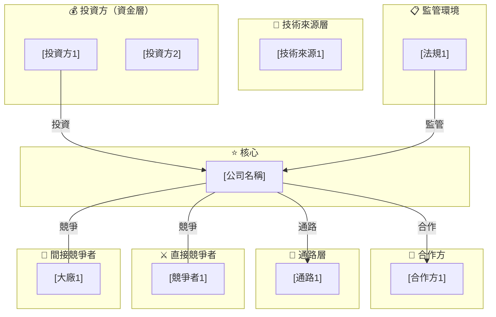

# [品牌/服務名稱] 服務創新案例報告

## 案例名稱
**[公司名]**（[官網]）— [一句話業務描述]

---

## 公司背景

[公司基本介紹：成立年份、地點、全名、核心業務]

### 早期輪：如何被發現、誰投了、為什麼投

#### 口碑發酵的過程
[描述產品如何被發現、社群傳播路徑]

#### 投資方一：[投資方名稱]
[投資方詳細介紹：創辦背景、投資理念、LP 結構、與本案例的契合度]

#### 投資方二：[投資方名稱]
[同上]

---

## 創辦人背景

### [創辦人一]｜Co-Founder & CEO
[學歷、前雇主（完整列表）、在前雇主的具體工作內容]

### [創辦人二]｜Co-Founder & CTO
[同上]

---

## 推出這項服務的背景

### 市場痛點
[要解決什麼問題]

### 創業靈感的起點
[創辦故事，引用創辦人的說法]

### 技術時機的成熟
[為什麼是現在，技術條件如何成熟]

---

## 推出時間

### 🕰 完整時間線

**[年份]**
[事件描述]
> 來源：[媒體名稱]（[日期]）— "[引文摘要]"

**[年份]**
[事件描述]
> 來源：[媒體名稱]（[日期]）— "[引文摘要]"

[以此類推，每個重要節點一段]

---

## 推薦原因

[服務概述：1-2 段]

### 真實口碑與回饋

---

**👤 [說話者姓名]｜[說話者身份]**
> *「[引言原文]」*
> （[翻譯]）

出處：[媒體/來源]（[日期]）

---

**👤 [說話者姓名]｜[說話者身份]**
> *「[引言原文]」*

出處：[媒體/來源]（[日期]）

[至少 3-5 則引言]

---

## 應用情境

### 一、消費者端：現有功能與使用場景

**1. [功能名稱]（[功能類型]）**
[描述]
> 來源：[來源]

**2. [功能名稱]**
[描述]
> 來源：[來源]

[以此類推]

---

### 二、品牌端：B2B 潛力與合作模式

[B2B 場景描述、商業模式、合作方式]

---

### 三、創辦人對未來應用場景的願景

[訪談或公開聲明中提及的規劃方向]

---

## 創新類型（六項單選）

**✅ [選中的創新類型]**

[說明為何選這個，排除其他選項的理由，引用創辦人說法]

---

## 創新模式（四項複選）

**✅ 新服務概念**
[具體體現]

**✅ 新客戶服務介面**
[具體體現]

**✅ 新服務傳遞方式**
[具體體現]

**✅ 新科技應用**
[具體體現]

---

## 產業生態系地圖

[Mermaid 圖的說明文字]



**圖說：**
- 實線箭頭（→）= 主動合作、資金流向
- 虛線箭頭（-.→）= 間接影響
- 無方向線（---）= 競爭關係

---

## PESTEL 分析

**分析標的**：[公司名]
**產業別**：[產業]
**地理範圍**：[市場範圍]
**分析目的**：SWOT 前置外部環境掃描
**時間視窗**：[時間範圍]

### PESTEL 評分總覽表

| 編號 | 面向 | 因素名稱 | 影響方向 | 重要性 | 影響程度 | 時效性 | 優先分 | 列為 |
|------|------|----------|----------|--------|----------|--------|--------|------|
| T-01 | 技術 | [因素名稱] | 機會 | X | X | X | XX | 有效 |
| [以此類推] | | | | | | | | |

### 有效因素清單（優先分 ≥ 12）

**[T-01] [因素名稱]**
描述：[詳細描述]
來源依據：[來源]
影響方向：[機會/威脅/中性]傾向
重要性：X/5
影響程度：X/5
時效性：X/3
優先分：XX

[以此類推]

### 觀察項清單（優先分 6-11）

[列出觀察項]

### PESTEL → SWOT 移交包

```
機會池（依優先分排序）：
  [編號] 因素｜優先分：XX｜說明

威脅池（依優先分排序）：
  [編號] 因素｜優先分：XX｜說明

觀察項：
  [編號] 因素｜升級條件：...
```

---

## 五力分析

### 1. 現有競爭者的競爭強度 ▶ [等級]
[直接競爭者列表（有名稱有金額）]
[間接競爭者列表]
[競爭強度判斷說明]

### 2. 新進者威脅 ▶ [等級]
[分析]

### 3. 替代品威脅 ▶ [等級]
[分析]

### 4. 供應商議價能力 ▶ [等級]
[分析]

### 5. 買方議價能力 ▶ [等級]
[分析]

---

## SWOT 分析

### Strengths（優勢）
- **S1 [優勢名稱]**：[描述]（來源：[來源]）
- **S2 [優勢名稱]**：[描述]（來源：[來源]）
- **S3 [優勢名稱]**：[描述]（來源：[來源]）

### Weaknesses（劣勢）
- **W1 [劣勢名稱]**：[描述]（來源：[來源]）
- **W2 [劣勢名稱]**：[描述]（來源：[來源]）
- **W3 [劣勢名稱]**：[描述]（來源：[來源]）

### Opportunities（機會）
- **O1 [[PESTEL編號]] [機會名稱]**：[描述]（優先分：XX）
- **O2 [[PESTEL編號]] [機會名稱]**：[描述]（優先分：XX）
- **O3 [[PESTEL編號]] [機會名稱]**：[描述]（優先分：XX）

### Threats（威脅）
- **T1 [[PESTEL編號]] [威脅名稱]**：[描述]（優先分：XX）
- **T2 [[PESTEL編號]] [威脅名稱]**：[描述]（優先分：XX）
- **T3 [[PESTEL編號]] [威脅名稱]**：[描述]（優先分：XX）

---

## SWOT 碰撞策略

### SO 策略（優勢 × 機會）
- **SO1 [S××O×] [策略名稱]**：[說明]
- **SO2 [S×××O×] [策略名稱]**：[說明]

### WO 策略（劣勢 × 機會）
- **WO1 [W×××O×] [策略名稱]**：[說明]
- **WO2 [W×××O×] [策略名稱]**：[說明]

### ST 策略（優勢 × 威脅）
- **ST1 [S×××T×] [策略名稱]**：[說明]
- **ST2 [S×××T×] [策略名稱]**：[說明]

### WT 策略（劣勢 × 威脅）
- **WT1 [W×××T×] [策略名稱]**：[說明]
- **WT2 [W×××T×] [策略名稱]**：[說明]

---

## 主要策略選擇

**最強策略：[策略代號] [策略名稱]**

**選擇理由（有依據）**：
[引用 PESTEL 優先分說明為何選這個威脅/機會]
[引用創辦人或媒體的真實話語]
[說明為何這個策略比其他 7 個更強]

---

## 鎖定客群（STP 分析）

### S — 市場區隔（Segmentation）

**來自 PESTEL 的輸入（只引用優先分 ≥ 48 的因素）：**
- **[PESTEL編號] [因素名稱]（優先分 XX）**：[說明如何影響區隔設計]
- **[PESTEL編號] [因素名稱]（優先分 XX）**：[說明]

優先分低於 48 的因素（如 [因素]）不納入區隔設計。

**來自五力分析的輸入：**
- [關鍵洞察：切換成本、替代品結構]

**來自 SWOT 的輸入：**
- [關鍵劣勢如何自然篩選用戶群]

**→ 區隔維度：**

**維度一：[維度名稱]**（依據：[PESTEL編號] + [五力洞察] + [SWOT]）
- **A [類型一]**：[描述]
- **B [類型二]**：[描述]

**維度二：[維度名稱]**（依據：[PESTEL編號] + [五力洞察]）
- **X [類型一]**：[描述]
- **Y [類型二]**：[描述]

四個區隔：**AX**、AY、**BX**、BY

---

### T — 目標客群（Targeting）

| 區隔 | PESTEL（優先分） | 五力結構 | SWOT 能力 | 結論 |
|------|----------------|---------|-----------|------|
| **AX** | [因素][分數] | [洞察] | [SWOT 對應] | ✅ **主要目標** |
| **BX** | [因素][分數] | [洞察] | [SWOT 對應] | ⚠️ 次要 |
| AY | [因素][分數] | [洞察] | [SWOT 對應] | ❌ 排除 |
| BY | [因素][分數] | [洞察] | [SWOT 對應] | ❌ 排除 |

**主要目標客群的具體特徵（有來源）：**
- [特徵 1]（來源：[來源]）
- [特徵 2]（來源：[來源]）

---

### P — 定位（Positioning）

**定位完全從主要策略 [策略代號] 推導：**

[說明主要策略的邏輯是什麼，如何形成定位]

**定位句**：[一句話定位]

**定位對照（只看主要策略的競爭對手）**：

| | [競爭者 1] | [競爭者 2] | **[公司名]（[策略代號] 定位）** |
|--|--|--|--|
| 核心訴求 | [訴求] | [訴求] | **[差異點]** |
| 技術方式 | [方式] | [方式] | [方式] |
| 用戶感知 | [感知] | [感知] | **[差異感知]** |

---

## 服務模式 / 商業模式圖

### 0. 震央選擇（Epicenter Selection）

**震央：[震央類型]**

| 依據來源 | 內容 | 指向 |
|---------|------|------|
| SWOT [S/W 項] | [說明] | [震央類型] ✅ |
| 主要策略 [代號] | [說明] | [震央類型] ✅ |
| 五力：[洞察] | [說明] | 排除 [某震央] |
| SWOT [W 項] | [說明] | 排除 [某震央] |

[九格設計，按震央推導順序填入]

---

## 顧客 Persona（依據分析，非主觀創造）

**人物：[Persona 姓名]，[年齡]歲，[地點] [職業]**

| 屬性 | 內容 | 來源依據 |
|------|------|----------|
| **職業** | [內容] | [來源] |
| **年齡** | [內容] | [來源] |
| **地點** | [內容] | [來源] |
| **品味偏好** | [內容] | [來源] |
| **行為特徵** | [內容] | [來源] |
| **試用/購買動機** | [內容] | [來源] |
| **社群行為** | [內容] | [來源] |
| **發現方式** | [內容] | [來源] |

**Persona 的核心痛點**：[描述]

**Persona 的核心動力**：[描述]

---

## 服務藍圖（Service Blueprint）

**服務範疇**：[服務範疇]
**用戶類型**：[目標客群描述]

| 層次 | [階段1] | [階段2] | [階段3] | [階段4] | [階段5] |
|------|---------|---------|---------|---------|---------|
| **實體支援** | | | | | |
| **用戶行動** | | | | | |
| **— 互動線 —** | | | | | |
| **前台：科技層** | | | | | |
| **前台：真人層** | | | | | |
| **— 可視線 —** | | | | | |
| **後台** | | | | | |
| **— 內部互動線 —** | | | | | |
| **支援系統** | | | | | |

### 流程缺口診斷（⚡）

| 缺口位置 | 問題描述 | 嚴重程度 | 來源依據 | 對應 SWOT | 建議方向 |
|---------|---------|---------|---------|---------|---------|
| ⚡⚡ [缺口1] | [描述] | 最高 | [來源] | [SWOT項] | [建議] |
| ⚡ [缺口2] | [描述] | 中 | [來源] | [SWOT項] | [建議] |

---

## 顧客旅程地圖（Customer Journey Map）

> **Persona**：[Persona 姓名]，[描述]
> **產品**：[服務名稱]
> **情緒分數**：已啟用（1-5 分，基準線 3）
> **注意**：旅程以真實用戶反饋為依據，包含真實摩擦點

### 旅程地圖

| 項目 | [階段1] | [階段2] | [階段3] | [階段4] | [階段5] |
|------|---------|---------|---------|---------|---------|
| **動機** | | | | | |
| **行動** | | | | | |
| **情緒曲線** | **X 分** | **X 分** | **X 分** | **X 分** | **X 分** |
| **接觸點** | | | | | |
| **感受 / 關鍵時刻** | | | | | |
| **科技服務** | | | | | |
| **行銷方法** | | | | | |
| **目標** | | | | | |

### 情緒分數明細

| 階段 | 情緒分數 | 加分原因 | 減分原因 |
|------|----------|----------|----------|
| [階段1] | **X 分** | ＋X [加分原因（來源）] | －X [減分原因（來源）] |
[以此類推]

**⭐ Aha Moment**（若有）：[說明 Aha Moment 的觸發條件和前提]

**最大風險點**：[哪個階段情緒最低，原因是什麼]

---

## 創造效果 / 解決問題

### 一、試圖解決的核心問題

**問題一：[問題名稱]**
[描述，含數據佐證]

**問題二：[問題名稱]**
[描述]

### 二、目前實際已解決的程度

| 問題 | 解決程度 | 有來源的依據 |
|------|----------|-------------|
| [問題1] | ✅/⚠️/❌ [說明] | [來源] |
[以此類推]

### 三、尚未解決的問題（技術 / 商業 / 體驗缺口）

**缺口一：[缺口名稱]**
[描述，含來源]

### 四、從分析角度的整體評估

[連結 SWOT 和 CJM 的整體判斷]

---

## 相關展示（非必要）
- 官網：[URL]
- App Store / 主要平台：[URL]
- 社群媒體：[帳號]

---

## 目前成效 / 獲獎情況 / 外部討論關鍵

### 一、目前營運成效（可查證數字）

| 指標 | 數字 / 狀態 | 來源 |
|------|------------|------|
| [指標1] | [數字] | [來源] |
[以此類推]

**重要說明**：[公司名] 未公開的數字（如用戶數、MAU 等）不在此列。

### 二、獲獎與外部認可

[列出有來源的認可項目]

### 三、外部討論關鍵

**媒體報導時間軸：**

| 時間 | 媒體 | 事件 |
|------|------|------|
[以此類推]

**關鍵聲音（正面）：**
[列出引言]

**關鍵聲音（批評）：**
[列出引言，不能省略]

---

## 背後代表的啟發與意義

**一、[啟發名稱]**

[分析依據（來自哪個分析模型）]
[在本案例的體現]
[可應用到其他案例的普遍規律]

**二、[啟發名稱]**

[同上格式]

[以此類推，建議 3-5 個啟發]

---

## 參考資料

### 一、主要媒體與報導

1. **[媒體名]**（[日期]）— [標題/說明]
   [URL]

### 二、產業分析與評測

[以此類推]

### 三、投資方與融資資料

[以此類推]

### 四、創辦人與公司一手來源

[以此類推]

### 五、數據與市場研究

[以此類推]
