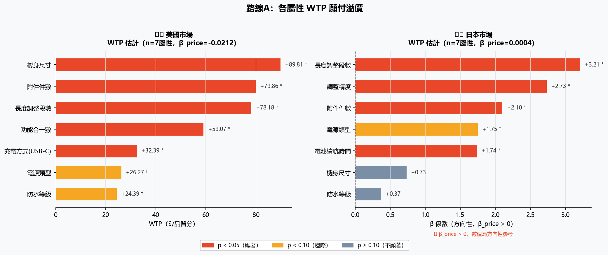
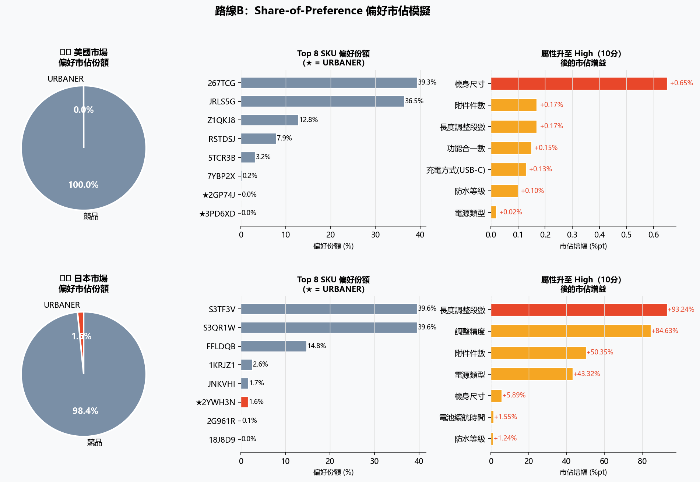
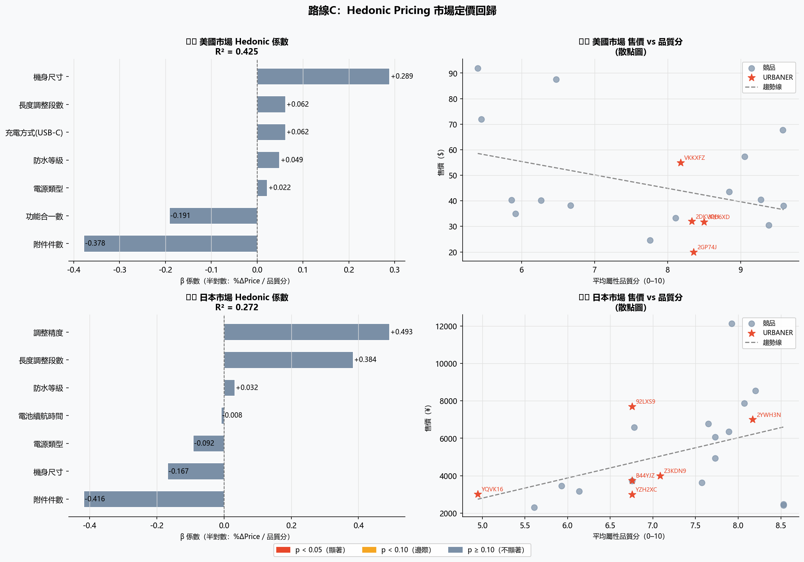

# URBANER 延伸分析報告

> **路線A**：WTP 願付溢價（補入真實售價重估 β_price）  
> **路線B**：Share-of-Preference 偏好市佔模擬  
> **路線C**：Hedonic Pricing 市場定價回歸  
> **資料截止**：2026-05-07　　**最新競品月份**：2026-03

---

## 路線A：WTP 願付溢價分析

### 方法說明

以各 ASIN 的**真實 Amazon 售價**（USD / JPY）作為連續變數，
透過 Split-model Logistic Regression 估計 β_price。
WTP 公式：`WTP(屬性升一級) = β_屬性 / |β_price|`，
代表消費者願意為該屬性品質提升一個品質分（0–10 scale）多付的金額。

### 🇺🇸 美國市場

- 有效樣本：19 個 SKU
- β_price = `-0.0212`　p = `0.3864` 
- 可靠性：✅ 可計算 WTP

| 排名 | 屬性 | β 係數 | WTP（$/品質分） | p 值 | 顯著 |
|---:|---|---:|---:|---:|:---:|
| 1 | 機身尺寸 | 1.9001 | $89.81 | 0.0209 | * |
| 2 | 附件件數 | 1.6897 | $79.86 | 0.0172 | * |
| 3 | 長度調整段數 | 1.6541 | $78.18 | 0.0114 | * |
| 4 | 功能合一數 | 1.2497 | $59.07 | 0.0244 | * |
| 5 | 充電方式(USB-C) | 0.6854 | $32.39 | 0.0346 | * |
| 6 | 電源類型 | 0.5558 | $26.27 | 0.0799 | † |
| 7 | 防水等級 | 0.5160 | $24.39 | 0.0929 | † |

### 🇯🇵 日本市場

- 有效樣本：21 個 SKU
- β_price = `0.0004`　p = `0.0963` †
- 可靠性：⚠️ β_price 為正，WTP 僅供方向參考

| 排名 | 屬性 | β 係數 | WTP（¥/品質分） | p 值 | 顯著 |
|---:|---|---:|---:|---:|:---:|
| 1 | 長度調整段數 | 3.2111 | ¥7961.07 | 0.0419 | * |
| 2 | 調整精度 | 2.7321 | ¥6773.50 | 0.0241 | * |
| 3 | 附件件數 | 2.1001 | ¥5206.70 | 0.0221 | * |
| 4 | 電源類型 | 1.7489 | ¥4335.87 | 0.0528 | † |
| 5 | 電池續航時間 | 1.7370 | ¥4306.33 | 0.0304 | * |
| 6 | 機身尺寸 | 0.7309 | ¥1812.08 | 0.2128 |  |
| 7 | 防水等級 | 0.3665 | ¥908.64 | 0.2278 |  |

> ⚠️ β_price > 0，WTP 方向性參考



> **WTP 解讀**：若 β_price < 0（符合經濟理論），WTP = β_屬性 / |β_price|，
> 表示消費者願意為該屬性每提升 1 分（0–10 scale）多付的金額。
> 若 β_price > 0，代表樣本中高售價商品評分反而較高（品質訊號效果），
> WTP 數字在此情境下為方向性參考，不宜直接用於定價決策。

---

## 路線B：Share-of-Preference 偏好市佔模擬

### 方法說明

以 Multinomial Logit 計算選擇集（URBANER + 競品）中各 SKU 的偏好份額：
```
P(選擇 i) = exp(Uᵢ) / Σ exp(Uⱼ)　　Uᵢ = Σ β_attr × 品質分
```
選擇集：URBANER（US 4個 / JP 6個）
＋競品（US 15個 / JP 15個）

### 🇺🇸 美國市場

| | 偏好份額 |
|---|---:|
| URBANER 合計 | **0.0%** |
| 競品合計 | 100.0% |

#### 各 SKU 偏好份額排名（前 10）

| 排名 | ASIN | 品牌 | 偏好份額 | avg★ |
|---:|---|---|---:|---:|
| 1 | `B0FL267TCG` | 競品 | 39.35% | 4.52 |
| 2 | `B0GLJRLS5G` | 競品 | 36.48% | 4.91 |
| 3 | `B0G1Z1QKJ8` | 競品 | 12.85% | 4.68 |
| 4 | `B0F2RSTDSJ` | 競品 | 7.90% | 4.47 |
| 5 | `B0FS5TCR3B` | 競品 | 3.20% | 4.28 |
| 6 | `B0D97YBP2X` | 競品 | 0.20% | 3.91 |
| 7 | `B0GL2GP74J` | **URBANER** | 0.01% | 4.19 |
| 8 | `B0823PD6XD` | **URBANER** | 0.01% | 4.40 |
| 9 | `B0BVVKKXFZ` | **URBANER** | 0.01% | 4.23 |
| 10 | `B0GHS5T1Y3` | 競品 | 0.00% | 3.47 |

#### 屬性升級模擬（將 URBANER 各屬性品質分升至 High=10）

| 排名 | 升級屬性 | 現況份額 | 升級後份額 | 增幅 |
|---:|---|---:|---:|---:|
| 1 | 機身尺寸 | 0.0% | 0.7% | **+0.7%** |
| 2 | 附件件數 | 0.0% | 0.2% | **+0.2%** |
| 3 | 長度調整段數 | 0.0% | 0.2% | **+0.2%** |
| 4 | 功能合一數 | 0.0% | 0.2% | **+0.1%** |
| 5 | 充電方式(USB-C) | 0.0% | 0.1% | **+0.1%** |
| 6 | 防水等級 | 0.0% | 0.1% | **+0.1%** |
| 7 | 電源類型 | 0.0% | 0.0% | **+0.0%** |

### 🇯🇵 日本市場

| | 偏好份額 |
|---|---:|
| URBANER 合計 | **1.6%** |
| 競品合計 | 98.4% |

#### 各 SKU 偏好份額排名（前 10）

| 排名 | ASIN | 品牌 | 偏好份額 | avg★ |
|---:|---|---|---:|---:|
| 1 | `B0FJS3TF3V` | 競品 | 39.60% | 4.34 |
| 2 | `B0FJS3QR1W` | 競品 | 39.60% | 4.34 |
| 3 | `B07YFFLDQB` | 競品 | 14.78% | 4.45 |
| 4 | `B0BY1KRJZ1` | 競品 | 2.58% | 4.16 |
| 5 | `B016JNKVHI` | 競品 | 1.71% | 4.20 |
| 6 | `B0BL2YWH3N` | **URBANER** | 1.59% | 4.33 |
| 7 | `B0742G961R` | 競品 | 0.14% | 4.55 |
| 8 | `B0BY18J8D9` | 競品 | 0.00% | 3.99 |
| 9 | `B0FQW4KWRD` | 競品 | 0.00% | 3.94 |
| 10 | `B0FQWLR3BW` | 競品 | 0.00% | 3.94 |

#### 屬性升級模擬（將 URBANER 各屬性品質分升至 High=10）

| 排名 | 升級屬性 | 現況份額 | 升級後份額 | 增幅 |
|---:|---|---:|---:|---:|
| 1 | 長度調整段數 | 1.6% | 94.8% | **+93.2%** |
| 2 | 調整精度 | 1.6% | 86.2% | **+84.6%** |
| 3 | 附件件數 | 1.6% | 52.0% | **+50.4%** |
| 4 | 電源類型 | 1.6% | 44.9% | **+43.3%** |
| 5 | 機身尺寸 | 1.6% | 7.5% | **+5.9%** |
| 6 | 電池續航時間 | 1.6% | 3.1% | **+1.6%** |
| 7 | 防水等級 | 1.6% | 2.8% | **+1.2%** |



---

## 路線C：Hedonic Pricing 市場定價回歸

### 方法說明

以**市場上各 SKU 的實際售價（取對數）**為因變數，
產品屬性品質分（0–10）為自變數，進行 OLS 線性回歸：
```
ln(Price) = β₀ + β₁×附件件數品質分 + β₂×防水等級品質分 + ... + ε
```
每個 β 代表：**市場上的競品，每提升 1 分品質，售價會上漲 β×100% 幅度**
（半對數模型解讀：Δln(P) ≈ %ΔP）。
此方法純粹從市場定價行為反推 WTP，不需要問卷。

### 🇺🇸 美國市場（USD）

- 有效樣本：19 個 SKU
- R² = `0.425`　Adj-R² = `0.059`

| 排名 | 屬性 | β 係數 | 價格彈性（%/分） | p 值 | 顯著 |
|---:|---|---:|---:|---:|:---:|
| 1 | 附件件數 | -0.3778 | -37.8% | 0.1662 |  |
| 2 | 機身尺寸 | 0.2893 | 28.9% | 0.1095 |  |
| 3 | 功能合一數 | -0.1913 | -19.1% | 0.2985 |  |
| 4 | 長度調整段數 | 0.0621 | 6.2% | 0.7614 |  |
| 5 | 充電方式(USB-C) | 0.0619 | 6.2% | 0.3250 |  |
| 6 | 防水等級 | 0.0489 | 4.9% | 0.5365 |  |
| 7 | 電源類型 | 0.0223 | 2.2% | 0.8309 |  |

### 🇯🇵 日本市場（JPY）

- 有效樣本：21 個 SKU
- R² = `0.272`　Adj-R² = `-0.120`

| 排名 | 屬性 | β 係數 | 價格彈性（%/分） | p 值 | 顯著 |
|---:|---|---:|---:|---:|:---:|
| 1 | 調整精度 | 0.4930 | 49.3% | 0.4856 |  |
| 2 | 附件件數 | -0.4165 | -41.6% | 0.5085 |  |
| 3 | 長度調整段數 | 0.3843 | 38.4% | 0.6015 |  |
| 4 | 機身尺寸 | -0.1673 | -16.7% | 0.5885 |  |
| 5 | 電源類型 | -0.0918 | -9.2% | 0.6163 |  |
| 6 | 防水等級 | 0.0323 | 3.2% | 0.7377 |  |
| 7 | 電池續航時間 | -0.0078 | -0.8% | 0.9023 |  |



> **Hedonic 解讀**：β = 0.05 代表該屬性品質分每提升 1 分，
> 市場上對應產品的售價平均高出約 5%。
> 此為市場觀察值（revealed preference），反映的是**競品定價策略**，
> 而非消費者主觀願付金額，兩者概念不同，可互為參照。

---

## 三條路線綜合比較

| | 路線A WTP | 路線B 市佔 | 路線C Hedonic |
|---|---|---|---|
| 核心問題 | 消費者願意多付多少？ | URBANER 市佔有多少？ | 市場如何用屬性定價？ |
| 資料來源 | 品質分 + 真實售價 | 品質分 + 月銷量 | 品質分 + 競品售價 |
| 方法 | Logit β_price | Multinomial Logit | OLS 半對數回歸 |
| 不需問卷 | ✅ | ✅ | ✅ |
| 結果用途 | 定價 / 升級決策 | 競品策略 / 規格優化 | 定價參考 / 市場定位 |

---

## 限制說明

| 項目 | 說明 |
|---|---|
| 樣本數 | 路線A/C US 約 19 個、JP 約 21 個，統計推論力有限，結果為方向性 |
| β_price 方向 | 若為正，代表樣本中高價品質較高（品質訊號），WTP 需謹慎解讀 |
| 路線B 選擇集 | 僅限 001 類別 ASIN，未涵蓋所有市場競品 |
| Hedonic 模型 | 多重共線性可能影響各 β 的穩定性（屬性間存在相關） |
| 時間點 | 競品銷量取最新單月，可能受季節因素影響 |

---

*分析腳本：`extended_analysis.py`　　輸出路徑：`output_conjoint/`*  
*作者：FourSight Lab × URBANER 產學合作專案*